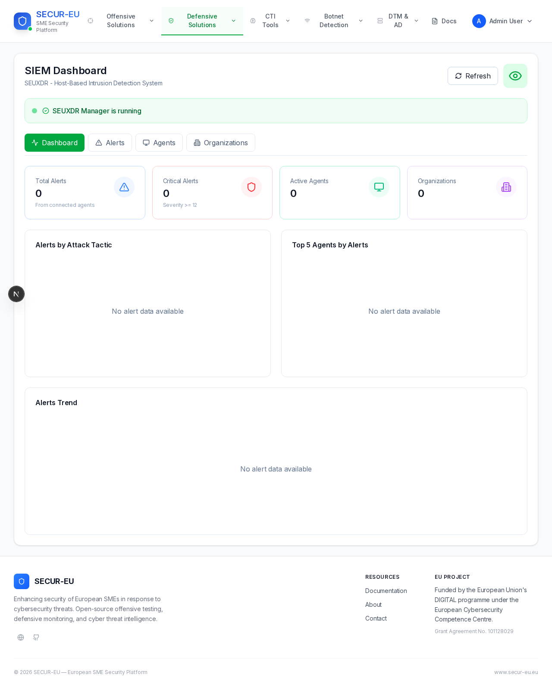
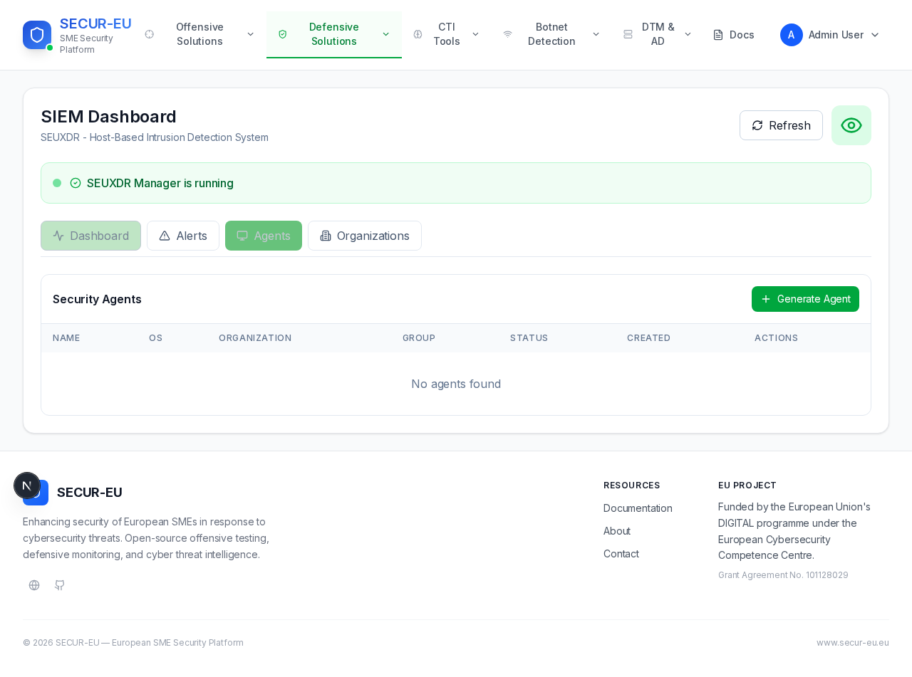
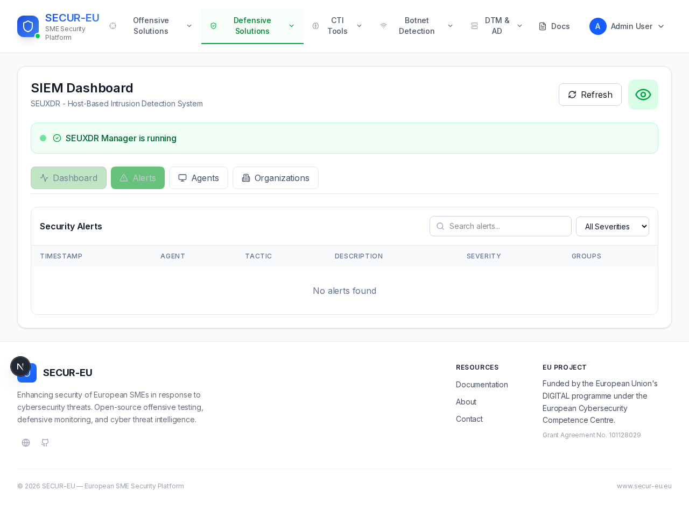
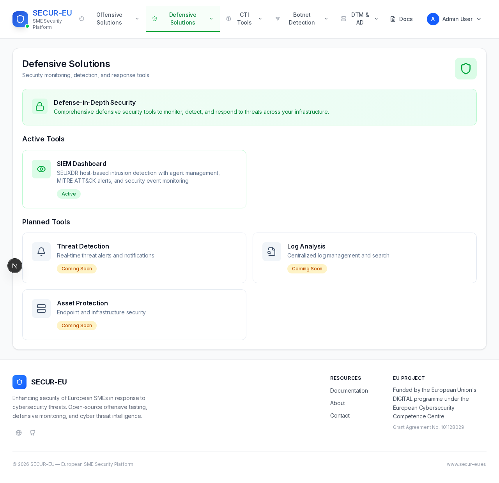

# SECUR-EU Platform

A unified cybersecurity dashboard integrating offensive and defensive security tools into a single platform. Built for the SECUR-EU project to provide security teams with centralized visibility across threat intelligence, vulnerability assessment, intrusion detection, and network monitoring.

## Architecture

```
                          ┌─────────────────────────────┐
                          │      Next.js Dashboard       │
                          │        (port 3000)           │
                          └──────────┬──────────────────┘
                                     │
              ┌──────────────────────┼──────────────────────┐
              │                      │                      │
     ┌────────▼────────┐   ┌────────▼────────┐   ┌────────▼────────┐
     │  CTI Services    │   │ Defensive Sec   │   │ Offensive Sec   │
     │                  │   │                 │   │                 │
     │ - Dark Web Intel │   │ - SIEM (SEUXDR) │   │ - Pentest Suite │
     │ - Red Flags (AD) │   │ - DTM Traffic   │   │ - SSL Checker   │
     │ - VSP Scoring    │   │ - SQS Botnet    │   │                 │
     └─────────────────┘   └─────────────────┘   └─────────────────┘
```

## Features

### Cyber Threat Intelligence (CTI)
- **Dark Web Monitoring** — Automated scanning of dark web sources for leaked credentials and organizational mentions
- **Red Flags (Log Anomaly Detection)** — AI-powered log analysis using LLM models to detect anomalous patterns
- **Vulnerability Score Prediction (VSP)** — ML-based CVSS score prediction from vulnerability descriptions using NLP

### Defensive Security
- **SIEM Dashboard (SEUXDR)** — Host-based intrusion detection powered by Wazuh, with agent management, alert monitoring, and organization-level visibility
- **Data Traffic Monitoring (DTM)** — Network traffic analysis via Suricata with Kafka-based ingestion pipeline
- **Anomaly Detection** — Statistical anomaly detection on network traffic patterns
- **Botnet Detection (SQS)** — sFlow-based botnet detection with OpenSearch analytics

### Offensive Security
- **Pentest Suite** — Automated penetration testing with Nmap, OWASP ZAP, and Metasploit
- **SSL/TLS Checker** — Certificate validation and security assessment

## Tech Stack

| Layer | Technology |
|-------|-----------|
| Frontend | Next.js 15, React 19, Tailwind CSS, Recharts |
| Auth | JWT + bcrypt, MongoDB |
| SIEM | Wazuh (OpenSearch), Go API server, mTLS agents |
| Traffic | Suricata, Kafka, Logstash, Spring Boot (Java 17) |
| Botnet | sFlow, OpenSearch, Logstash, FastAPI |
| ML/AI | Flask, scikit-learn, NLTK, Ollama |
| Pentest | Go server, Nmap, ZAP, Metasploit (Docker) |
| Infra | Docker Compose, PostgreSQL, MongoDB, Kafka |

## Prerequisites

- Ubuntu 22.04 or 24.04 LTS
- 16 GB RAM minimum (Wazuh + OpenSearch + Kafka are memory-intensive)
- 50 GB disk space
- SSH access with sudo privileges

## Quick Start (Ansible)

Deploy the entire platform to a fresh Ubuntu server with a single command:

```bash
# 1. Install Ansible on your local machine
pip install ansible

# 2. Configure target server
cp inventory.yml.example inventory.yml
vi inventory.yml    # set your server IP and SSH user

# 3. Configure variables
vi vars.yml         # set jwt_secret, mongodb credentials

# 4. Deploy
ansible-playbook -i inventory.yml deploy.yml
```

The playbook automatically installs all dependencies (Docker, Node.js 20, Go 1.22, Java 17), copies the platform to `/opt/secur-eu/`, builds the frontend, and starts everything via systemd.

## Manual Installation

If you prefer to set up manually:

```bash
# Install dependencies
apt install -y docker.io nodejs npm default-jdk golang-go

# Copy platform to /opt
cp -r . /opt/secur-eu/

# Configure frontend
cd /opt/secur-eu/frontend
cp local.env .env    # edit with your server IP
npm ci && npm run build

# Start backend (all 10 service groups)
cd /opt/secur-eu/backend
chmod +x start.sh stop.sh
./start.sh

# Start frontend
cd /opt/secur-eu/frontend
npm start -- -p 3000
```

## Services Overview

After deployment, the following services are running:

| Service | Port | Description |
|---------|------|-------------|
| Dashboard | 3000 | Next.js web interface |
| SEUXDR Manager | 8443 (HTTPS) | SIEM/HIDS API server |
| SSL Checker | 5000 | TLS certificate analysis |
| Pentest | 3001 | Penetration testing API |
| VSP | 5002 | Vulnerability score prediction |
| Dark Web | 8001 | Dark web monitoring API |
| Red Flags | 8002 | Log anomaly detection |
| DTM | 8087 | Data traffic monitoring |
| Anomaly Detection | 5001 | Network anomaly detection |
| SQS (Botnet) | 8000 | Botnet detection API |
| OpenSearch | 9200 | Search and analytics engine |
| Kafka | 9092 | Message broker |
| MongoDB | 27017 | Dashboard auth database |
| PostgreSQL | 8432 | DTM/AD shared database |

## Managing Services

```bash
# Systemd services (after Ansible deployment)
sudo systemctl start|stop|status secureu-backend
sudo systemctl start|stop|status secureu-frontend

# View logs
journalctl -u secureu-frontend -f
journalctl -u secureu-backend -f

# Manual start/stop
cd /opt/secur-eu/backend
./start.sh    # starts all 10 backend service groups
./stop.sh     # gracefully stops everything
```

## Project Structure

```
secureu-platform/
├── deploy.yml                # Ansible deployment playbook
├── inventory.yml.example     # Target server template
├── vars.yml                  # Deployment variables
│
├── frontend/                 # Next.js dashboard
│   ├── app/                  # Pages and API routes
│   │   ├── api/              # Backend proxy routes
│   │   ├── defsec/           # Defensive security pages
│   │   ├── cti/              # Threat intelligence pages
│   │   ├── offsec/           # Offensive security pages
│   │   └── ...
│   ├── components/           # React components
│   │   ├── siem/             # SIEM Dashboard
│   │   ├── darkweb/          # Dark Web monitoring
│   │   ├── cti/              # VSP, Red Flags
│   │   ├── dtmad/            # Traffic monitoring
│   │   ├── sqs/              # Botnet detection
│   │   └── ...
│   └── lib/                  # Auth, DB utilities
│
└── backend/                  # Microservices
    ├── start.sh              # Start all services
    ├── stop.sh               # Stop all services
    ├── seuxdr/               # SIEM/HIDS (Wazuh + Go)
    ├── dtmad/                # DTM + Anomaly Detection (Java)
    ├── sqs/                  # Botnet detection (FastAPI)
    ├── darkweb/              # Dark web backend
    ├── redflags/             # Log anomaly (Ollama)
    ├── vsp/                  # Vulnerability scoring (Flask)
    ├── pentest/              # Pentest suite (Go)
    └── sslchecker/           # SSL checker (Flask)
```

## Screenshots

### SIEM Dashboard


### SIEM Stats & Alerts


### Agent Management


### Security Alerts


### Defensive Solutions


## License

This project is developed as part of the SECUR-EU research initiative.
