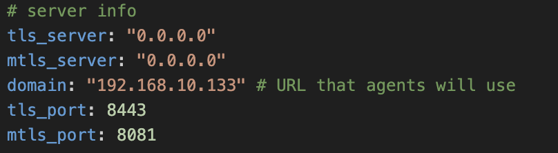
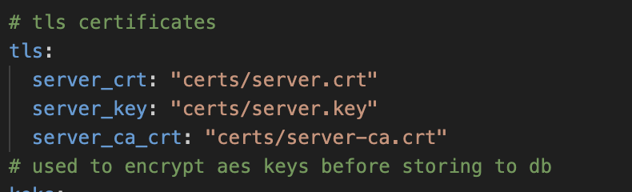
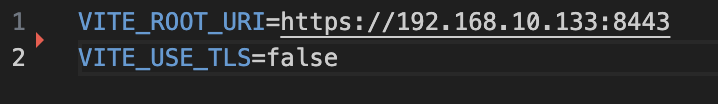
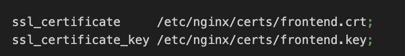
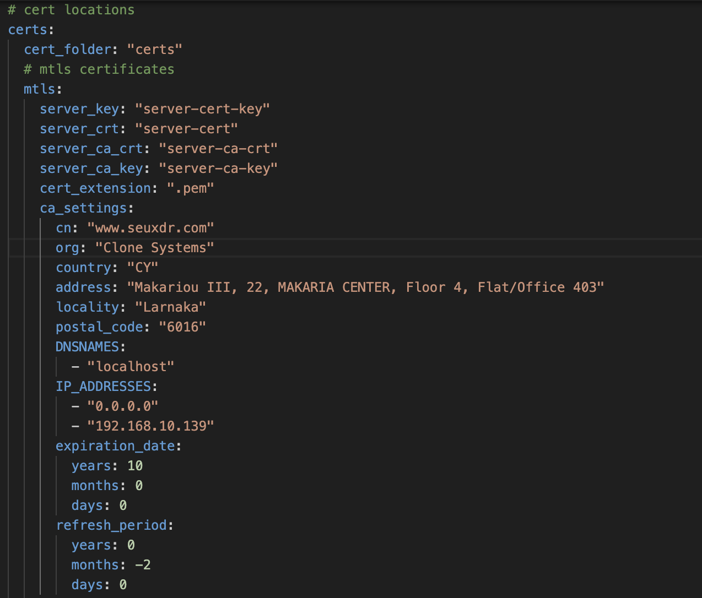
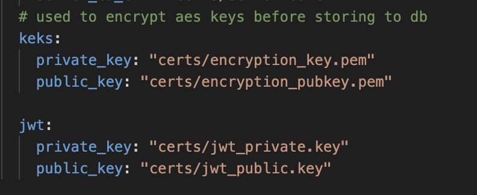

# SEUXDR

SEUXDR is an open-source, host-based intrusion detection system (HIDS) designed to monitor and respond to security events in real time. It performs log analysis, integrity checking, Windows registry monitoring, rootkit detection, and active response to threats. Written in Go, this implementation of OSSEC provides a high-performance, scalable solution for securing various platforms, including Linux, Windows, and macOS. Its modular architecture allows it to efficiently handle large volumes of data, making it ideal for security monitoring in enterprise environments.

## Table of Contents

- [SEUXDR](#seuxdr)
  - [Table of Contents](#table-of-contents)
  - [✨ Features](#-features)
  - [🐳 Docker Setup](#-docker-setup)
  - [🚀 Installation for testing & debugging](#-installation)
    - [🪟 Windows](#-windows)
    - [🍎 Mac OS](#-mac-os)
    - [🐧 Linux](#-linux)
  - [Usage](#usage)
  - [Contributing](#contributing)
  - [License](#license)
  - [Contact](#contact)

## ✨ Features

- **Log Analysis:** SEUXDR performs detailed analysis of system logs to detect malicious activity, helping identify security threats in real-time across multiple platforms.

- **Multi-Platform Support:** SEUXDR supports various operating systems, including Linux, Windows, and macOS, making it versatile for diverse IT environments.

- **Centralized Monitoring:** Provides centralized monitoring for distributed systems, making it easier to manage security across a large network of devices.

- **Real-Time Alerts:** Establishes real-time alert classifications and categorization. Instantly available through a UI.

- **Custom Rules and Configuration:** Supports custom rule sets, allowing administrators to tailor SEUXDR’s behavior to specific security requirements.

## 🚀 Docker Setup

1. Clone the repository:

   ```bash
   git clone https://github.com/SecureEU/seuxdr.git
   ```

2. If running in <ins><b>test mode</b></ins>, first open seuxdr/localhost.ext and add your host's IP to the list of IPs. To get your host's IP on macos, run:

   ```bash
   ifconfig | grep "inet " | grep -Fv 127.0.0.1 | awk '{print $2}' 
   ```

   For Windows:
   ```bash
   ipconfig | findstr /i "ipv4"
   ```
   
   On first run of the manager, we need to generate certificates for TLS. We also need an encryption key pair for token authentication during login. The repository includes a manager/gen-certs.sh for unix systems and manager/gen-certs.bat file for windows that can be used to generate the certificates required for setup. In the case of gen-certs.bat, if packages were missing, the script would have installed them in order to generate the certificates instead of generating the certificates. Check your manager/certs and manager_front/certs folders. If that was the case,  then simply run the file again. To run the file, open git bash on terminal on linux/macOS and run the following command:

   ```bash
   sh gen-certs.sh
   ```

   Or simply double-click the gen-certs.bat file on Windows.
   This should generate the TLS certificates for the manager server and the frontend server at manager/certs and frontend/certs respectively. It also generates all further encryption keys and jwt kehys for running in test mode so no further steps are required for generating keys.

   If running in <ins><b>prod mode</b></ins>, then similarly place your server certificates under manager/certs and your frontend certificates under manager_frontend/certs.

   To generate your encryption keys, you can use the following commands at /seuxdr:

   Generate private key:
   ```
   openssl genrsa -out manager/certs/jwt_private.key 2048
   ```
   Generate public key:
   ```
   openssl rsa -in manager/certs/jwt_private.key -pubout -out manager/certs/jwt_public.key
   ```

   Note: The env property in manager/manager.yaml is unrelated to the mode that docker is running. Make sure it remains with value PROD at all times.

3. To set up TLS on the backend, navigate to /manager/manager.yml and add the domain (or host IP if running locally) in the domain attribute, so that agents can know where to call your manager. If running in prod mode, make sure use_system_ca is set to true (keep false in local mode), so that agents can find your certificate's CA using their OS's trusted certificates.
   
Then navigate to the TLS property and add the paths to your certificates like so:
   

4. To set up TLS on the frontend, navigate to manager_front/.env and add your domain (or hosts's IP if running locally) there like so:

   

   Then, if you are running in prod mode, navigate to manager_frontend/nginx.conf and define your certificates like so:

   
   
   Make sure the filepath remains as depicted at etc/nginx/certs with only the names of the cert files being changed. This will help the nginx server find your certificates after the manager_front/certs directory is copied to it.
 
5. To ensure that the included mTLS functionality works, you must navigate to the mtls tag in manager/manager.yml. For CA and server, you must add the domain under the DNS tag (if running locally/on-premise set this to localhost and make sure your host's IP is included in the IP addresses of each one - i.e. server_settings.IP_ADDRESSES: 192.168.10.1).

   

6. Finally, if you are running in PROD mode (not on-premise) you must generate an encryption key pair (preferrably rsa keys) that will be used to encrypt/decrypt the encryption keys used in communication between manager and agent. You must place them under manager/certs. Their names need to be as reflected in the config (default encryption_key.pem, encryption_pubkey.pem). One way of doing so is using the commands below:

   ```bash
      openssl genrsa -out manager/certs/encryption_key.pem 2048
      openssl rsa -in manager/certs/encryption_key.pem -pubout -out manager/certs/encryption_pubkey.pem
   ```

   If you choose different names than the default, make sure this is reflected in the manager.yml file under the keks.

    

   You also need to generate encryption key for the jwt token signing and verification used in login. One way of doing so is using the commands below:

   ```
       openssl genrsa -out manager/certs/jwt_private.key 2048
       openssl rsa -in manager/certs/jwt_private.key -pubout -out manager/certs/jwt_public.key
   ```

   If you choose different names than the default, make sure this is reflected in the manager.yml file under the jwt tag.

7. To run the docker container go to your terminal and navigate to the root directory of the project at /seuxdr and run the following commands:

   ```bash
   docker compose up --build -d   
   ```
   ☝️ This builds the docker image, installs the dependencies required and runs the container in a process that supports systemd.
   ```bash
   docker exec -it seuxdr-manager /usr/local/bin/startup.sh TEST
   ```
   ☝️ This installs wazuh and our manager in conjuction with each other and amends the wazuh configs to monitor our desired directories. Use PROD instead of TEST if not running in test mode. Once this completes our installation is complete. It usually takes around 10 minutes for it to finish.

8. The UI should be available at https://your-hosts-IP:8080. If running in <b>local mode</b>, then before accessing it, you need to download and import the ca certificate that is used to verify both the frontend and frontend server. You can do so by running the following command:

   Linux/MacOS:
   ```bash
   curl -k -o server-ca.crt https://your-host-IP/api/certs/server-ca.crt
   ``` 

   Windows:
   ```bash
   curl.exe -k -o server-ca.crt https://your-host-ip:8443/api/certs/server-ca.crt
   ```

   Importing the CA is going to be different depending on your browser, but the process remains approximately the same: 
   Click on the top left 3 dots of your browser
   -> Privacy & Security or Security
   -> Manage Certificates
   -> Import
   -> Choose the server-ca.crt
   -> Trust Certificate Authority to verify sites


## Renewing Docker certificates

To renew the manager's TLS certificates in PROD mode, go to seuxdr/manager/certs and delete your TLS certificates. DO NOT delete the mtls certificates used for mTLS. If unsure, check your seuxdr/manager/manager.yaml to see which files are mapped under tls and which ones are under mTLS. If the MTLS certificates under seuxdr/manager/certs are lost, the manager will not be able to start up. With that in mind, you may want to back them up before updating your TLS certificates. Then proceed to add your new certificates with the same name as your previous ones. 

Now do the same for your certificates under manager_front/certs.

If running in test/local mode, you may simply delete the existing TLS certificates and run gen-certs.sh to regenerate new ones. Make sure to check that the ca is not expired before doing so. If it is, you can delete the TLS CA certificate and key and they will be regenerated using gen-certs.sh/gen-certs.bat.

For the changes to take effect, simply restart your docker container.

If the CA has been updated in test mode, make sure to re-download the CA certificate using step 8 from Docker Setup and add it to your browser's trusted CA certificates. Then, you also need to update the CA for your agent daemons as well:

On Windows:

   1. Go to Program Files/SEUXDR/certs
   2. Delete the old server-ca.crt
   3. Add the new downloaded one.

On Linux:

   1. Go to /var/seuxdr/certs
   2. Delete the old server-ca.crt
   3. Add the new downloaded one

On MacOS:

   1. Go to /var/seuxdr/certs
   2. Delete the old server-ca.crt
   3. Add the new downloaded one.

Once the agent CA certificates are updated, simply restart your device for the changes to take effect


## 🚀 Installation for debugging and testing

### 🪟 Windows

1. Clone the repository:

   ```bash
   git clone https://github.com/SecureEU/seuxdr.git
   ```

2. Download and install the latest version of golang from [Go's official website](https://go.dev/doc/install).

3. Install the latest versions of gcc, cgo and MINGW using [tdm64-gcc](https://jmeubank.github.io/tdm-gcc/download/). This is required for our sqlite db and migrations.

4. Download and install git bash if not already installed from [git's official website](https://git-scm.com/downloads). (To be able to run .sh files)

5. Go to the root directory of the repository:

   ```bash
   cd seuxdr
   go mod tidy
   ```

### 🍎 Mac OS

1. Clone the repository:

   ```bash
   git clone https://github.com/SecureEU/seuxdr.git
   ```

2. Download and install the latest version of golang from [Go's official website](https://go.dev/doc/install). You can also install it using brew.

   ```bash
   brew install go
   ```

3. Go to the root directory of the repository:

   ```bash
   cd seuxdr
   go mod tidy
   ```

### 🐧 Linux

1. Clone the repository:

   ```bash
   git clone https://github.com/SecureEU/seuxdr.git
   ```

2. Install golang using apt package

   ```bash
   sudo apt install golang-go
   ```

3. Install build-essential package (needed for sqlite)

   ```bash
   sudo apt-get install build-essential libsqlite3-dev
   ```

4. Go to the root directory of the repository:

   ```bash
   cd seuxdr
   go mod tidy
   ```

## Usage

### Wazuh Setup

1. To set up wazuh, follow the [quickstart instructions](https://documentation.wazuh.com/current/quickstart.html) at wazuh's website and set up the wazuh manager with its dashboard and indexer in a linux environment.

2. Then, create the following path on your root directory "/var/seuxdr/manager/queue" and go to edit wazuh's configuration in the ossec.conf file at "var/ossec/etc/ossec.conf".

The owner of the ossec.conf is likely to be set as wazuh, so to bypass that restriction, you can use the following command in the "/var" directory:

```bash
sudo nano ossec/etc/ossec.conf
```

Go to the end of the file where the log monitor configurations is and add the following config:

```
<localfile>
    <log_format>syslog</log_format>
    <location>/var/seuxdr/manager/queue/*.log</location>
</localfile>
```

Then press ctrl + x and then enter to save and close the file.

### Manager & Agent Setup

1. On first run of the server and agent, you need to generate certificates for mTLS so that the agent can register to the server. The repository includes a gen-certs.sh/gen-certs.bat file that can be used to generate the certificates required for setup. In the case of gen-certs.bat, If packages were missing, the script would have installed them in order to generate the certificates. Check your manager/certs and manager_front/certs folders. If that was the case, then simply run the file again. To run the file, open git bash on terminal on linux/macOS and run the following command:

   ```bash
   sh gen-certs.sh
   ```

   Or simply double-click the gen-certs.bat file on Windows.

2. After installation, you can run the SEUXDR manager with the following command:

   ```bash
   cd manager
   sudo go run main.go
   ```

3. The agent can run in 2 modes: TEST mode and PROD mode. This can be configured through the manager's configuration file - manager.yml. That is because the agent binary and its certificates are generated on the fly by the manager. Before running the agent. You need to create an organisation and group, then generate an agent for that group using the postman requests available to you.

In TEST mode, when the generateClient endpoint is called the manager generates the appropriate certificates and configs for the agent and stores them in the agent's certs and config folders, so that they are ready to use. Then, to run the agent simply use the following command in the SEUXDR directory:

```bash
go run ./agent
```

In PROD mode, when the generateClient endpoint is called the manager generates the appropriate certificates and configs and embeds them as part of the OS-specific executable that it then generates and stores in its database according to the OS and architecture requested in the endpoint request. The next step is to download the agent executable zipped folder and extract it. In the folder you should see 3 files: the executable, an installation file and an uninstall file. To run the agent, simply run the installation file included using root priviledges (Run as administrator in windows, sudo in linux and macOS - e.g. sudo sh install_seuxdr.sh). The agent will then install itself as a service into the OS and keep running indefinetly unless stopped,

4. Modify configuration files (agent.conf or similar) to customize your security settings and rules according to your environment if you wish. These should be available in the config folder generated in production mode after installation or in the agent/config folder in test mode.

5. For further documentation on using SEUXDR, refer to the docs folder in the repository.

## Contributing

We welcome contributions from the community!

## License

SEUXDR is licensed under the X License. See the [LICENSE](APACHE-LICENSE-2.0.txt) file for more details.

## Contact

For support, questions, or contributions, please contact [] or [open an issue](https://github.com/SecureEU/seuxdr/issues) on the repository.
